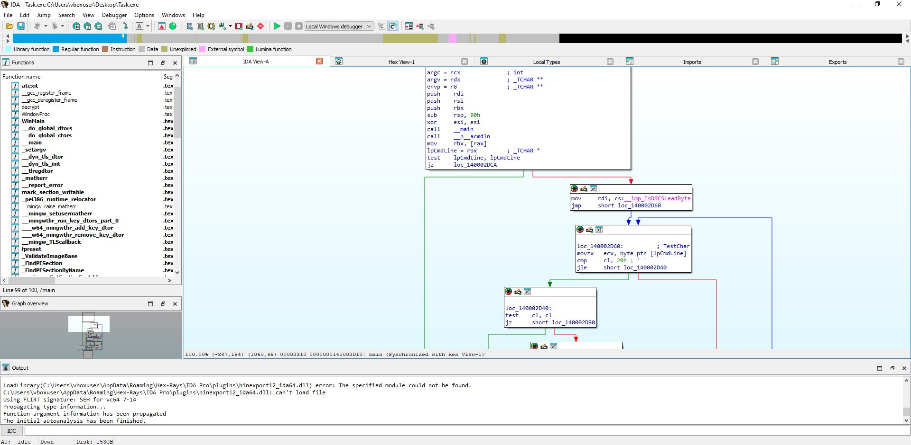
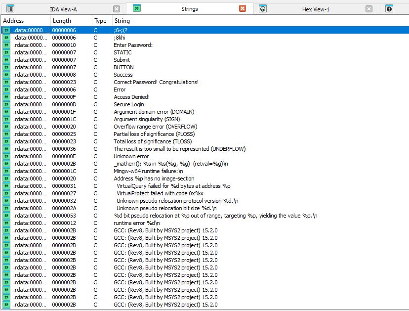
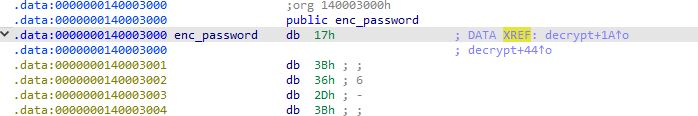
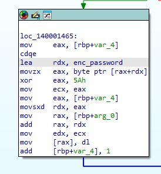
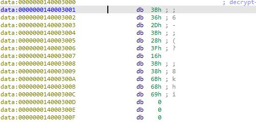
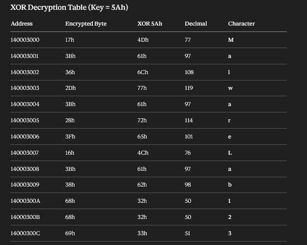
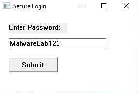
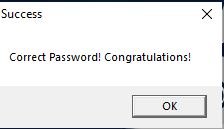

<div align="center">

```
██████╗ ███████╗██╗   ██╗███████╗██████╗ ███████╗███████╗
██╔══██╗██╔════╝██║   ██║██╔════╝██╔══██╗██╔════╝██╔════╝
██████╔╝█████╗  ██║   ██║█████╗  ██████╔╝███████╗█████╗  
██╔══██╗██╔══╝  ╚██╗ ██╔╝██╔══╝  ██╔══██╗╚════██║██╔══╝  
██║  ██║███████╗ ╚████╔╝ ███████╗██║  ██║███████║███████╗
╚═╝  ╚═╝╚══════╝  ╚═══╝  ╚══════╝╚═╝  ╚═╝╚══════╝╚══════╝
    ███████╗███╗   ██╗ ██████╗ ██╗███╗   ██╗███████╗
    ██╔════╝████╗  ██║██╔════╝ ██║████╗  ██║██╔════╝
    █████╗  ██╔██╗ ██║██║  ███╗██║██╔██╗ ██║█████╗  
    ██╔══╝  ██║╚██╗██║██║   ██║██║██║╚██╗██║██╔══╝  
    ███████╗██║ ╚████║╚██████╔╝██║██║ ╚████║███████╗
    ╚══════╝╚═╝  ╚═══╝ ╚═════╝ ╚═╝╚═╝  ╚═══╝╚══════╝
```

# 🔐 Reverse Engineering & Static Malware Analysis
### XOR Password Cracking via IDA Pro — Full Walkthrough

<br>

[](https://hex-rays.com/)
[]()
[]()
[]()
[]()

<br>

> **"Understanding how malware hides its secrets — one byte at a time."**

<br>

---

</div>

## 📖 Overview

This project documents a complete **static reverse engineering** workflow against a password-protected executable using **IDA Pro**. The binary hides its password using **XOR obfuscation with key `0x5A`** — a technique commonly employed by malware authors to evade string-based detection.

Through this analysis, we:
- Load and navigate a Windows PE binary in IDA Pro
- Identify obfuscated strings using the Strings window
- Locate the `decrypt` function and trace the XOR key
- Manually decrypt all encrypted bytes to recover the plaintext password
- Validate the cracked password against the live application

**Recovered Password:** `MalwareLab123`

---

## 🧰 Tools & Environment

| Tool | Version | Purpose |
|------|---------|---------|
| **IDA Pro** | 7.x (64-bit) | Static disassembly & analysis |
| **Windows 10** (VM) | x64 | Target execution environment |
| **Python 3** | 3.x | XOR decryption scripting |
| **VirtualBox** | Latest | Isolated sandbox environment |

---

## 🗂️ Repository Structure

```
📁 ida-re-xor-crack/
├── 📄 README.md                    ← You are here
├── 📄 ANALYSIS_REPORT.md           ← Full technical write-up
├── 📄 xor_decrypt.py               ← Standalone XOR decryption script
├── 📁 screenshots/
│   ├── 01_Loading_EXE_into_IDA_PRO.jpg
│   ├── 02_View_Strings_IDA_PRO.jpg
│   ├── 03_Open_Decrypt_Function.jpg
│   ├── 04_XOR_Key_5Ah_Found.jpg
│   ├── 05_Encrypted_Strings_Data.jpg
│   ├── 06_XOR_Decryption_Table.jpg
│   ├── 07_Password_Recovered.jpg
│   └── 08_Success_Correct_Password.jpg
└── 📁 scripts/
    └── batch_xor_decrypt.py        ← Batch decryption tool
```

---

## 🔬 Analysis Walkthrough

### Step 1 — Load the Target Binary into IDA Pro

The executable `Task.exe` is loaded into IDA Pro for static analysis. IDA performs its initial auto-analysis, identifies functions, and populates the function list. We can immediately observe key functions including `decrypt`, `WinMain`, and `WindowProc`.

<div align="center">


*IDA Pro loading Task.exe — function list visible in left panel*

</div>

---

### Step 2 — Enumerate Strings & Spot the Anomaly

Using **View → Open Subviews → Strings** (`Shift+F12`), we enumerate all readable strings in the binary. Among normal UI strings like `"Enter Password:"`, `"Submit"`, and `"Correct Password! Congratulations!"`, we notice a suspicious garbled string: **`;6-;(?`** — this is our encrypted password stored in the `.data` section.

<div align="center">


*Strings window revealing the obfuscated password `;6-;(?` alongside readable UI strings*

</div>

---

### Step 3 — Navigate to the `decrypt` Function

Double-clicking the suspicious string navigates us to address `0x140003000` in the `.data` section. The cross-reference (XREF) points to a function named **`decrypt`**. We follow the XREF to inspect the decryption logic.

<div align="center">


*enc_password at 0x140003000 — XREF leads directly to the decrypt routine*

</div>

---

### Step 4 — Identify the XOR Key: `0x5A`

Inside the `decrypt` function disassembly, we observe the critical instruction:

```asm
lea  rdx, enc_password    ; Load address of encrypted password
movzx eax, byte ptr [rax+rdx]  ; Load one encrypted byte
xor  eax, 5Ah             ; XOR with key 0x5A
```

The constant **`5Ah` (decimal 90)** is our XOR key. This single-byte rolling XOR is applied to each character of the encrypted password string.

<div align="center">


*Assembly view showing `xor eax, 5Ah` — the decryption key exposed*

</div>

---

### Step 5 — Map the Encrypted Bytes

Examining the raw data starting at `0x140003000`, we enumerate the encrypted bytes:

| Address | Hex Byte | ASCII |
|---------|----------|-------|
| 140003000 | `17h` | — |
| 140003001 | `3Bh` | `;` |
| 140003002 | `36h` | `6` |
| 140003003 | `2Dh` | `-` |
| 140003004 | `3Bh` | `;` |
| 140003005 | `28h` | `(` |
| 140003006 | `3Fh` | `?` |
| ... | ... | ... |

<div align="center">


*Raw encrypted bytes in the .data section — each byte XOR'd with 0x5A*

</div>

---

### Step 6 — Perform XOR Decryption

Applying XOR with key `0x5A` to each byte reveals the plaintext characters:

<div align="center">


*Complete XOR decryption table — encrypted bytes → plaintext characters*

</div>

The full decryption table:

| Address | Encrypted | XOR `5Ah` | Decimal | Character |
|---------|-----------|-----------|---------|-----------|
| 140003000 | `17h` | `4Dh` | 77 | **M** |
| 140003001 | `3Bh` | `61h` | 97 | **a** |
| 140003002 | `36h` | `6Ch` | 108 | **l** |
| 140003003 | `2Dh` | `77h` | 119 | **w** |
| 140003004 | `3Bh` | `61h` | 97 | **a** |
| 140003005 | `28h` | `72h` | 114 | **r** |
| 140003006 | `3Fh` | `65h` | 101 | **e** |
| 140003007 | `16h` | `4Ch` | 76 | **L** |
| 140003008 | `3Bh` | `61h` | 97 | **a** |
| 140003009 | `38h` | `62h` | 98 | **b** |
| 14000300A | `68h` | `32h` | 50 | **1** |
| 14000300B | `68h` | `32h` | 50 | **2** |
| 14000300C | `69h` | `33h` | 51 | **3** |

**🔓 Decrypted Password: `MalwareLab123`**

---

### Step 7 — Enter the Recovered Password

The decrypted password is entered into the application's login dialog.

<div align="center">


*Entering the recovered password `MalwareLab123` into the Secure Login dialog*

</div>

---

### Step 8 — Validation Success ✅

The application confirms the correct password — analysis complete.

<div align="center">


*"Correct Password! Congratulations!" — XOR decryption successful*

</div>

---

## 🐍 XOR Decryption Script

```python
# xor_decrypt.py — Decrypt XOR-obfuscated strings from IDA Pro analysis

encrypted_bytes = [0x17, 0x3B, 0x36, 0x2D, 0x3B, 0x28, 0x3F,
                   0x16, 0x3B, 0x38, 0x68, 0x68, 0x69]

XOR_KEY = 0x5A

decrypted = ''.join(chr(b ^ XOR_KEY) for b in encrypted_bytes)
print(f"[+] XOR Key:            0x{XOR_KEY:02X} ({XOR_KEY})")
print(f"[+] Encrypted bytes:    {[hex(b) for b in encrypted_bytes]}")
print(f"[+] Decrypted password: {decrypted}")
```

**Output:**
```
[+] XOR Key:            0x5A (90)
[+] Encrypted bytes:    ['0x17', '0x3b', '0x36', '0x2d', '0x3b', '0x28', '0x3f', '0x16', '0x3b', '0x38', '0x68', '0x68', '0x69']
[+] Decrypted password: MalwareLab123
```

---

## 🧠 Key Takeaways

- **XOR obfuscation** is a trivial but commonly used technique to hide strings from static scanners
- **Single-byte XOR keys** are immediately visible in disassembly as constant operands to `XOR` instructions
- IDA Pro's **XREF system** makes it easy to trace where encrypted data is referenced and processed
- Always **validate your decryption** by running the candidate password against the live binary
- Modern malware uses **multi-byte, rolling, or key-scheduled XOR** — the same methodology applies at greater complexity

---

## 🛡️ Defensive Implications

| Indicator | Detection Method |
|-----------|-----------------|
| Garbled strings in `.data` section | YARA rules on non-printable byte sequences |
| XOR decode loop pattern | Behavioral sandbox analysis |
| Short single-byte XOR key | Static byte entropy analysis |
| Runtime string decryption | API monitoring / dynamic tracing |

---

## 📚 References & Further Reading

- [IDA Pro Documentation](https://hex-rays.com/ida-pro/)
- [Malware Analyst's Cookbook](https://www.wiley.com/en-us/Malware+Analyst%27s+Cookbook)
- [Practical Malware Analysis — Sikorski & Honig](https://nostarch.com/malware)
- [FLARE-ON Challenge Archive](https://flare-on.com/)
- [OpenSecurityTraining2 — Reverse Engineering](https://ost2.fyi/)

---

<div align="center">

**Built with ❤️ for the cybersecurity community**

*Static analysis | Reverse engineering | Malware research*


</div>
